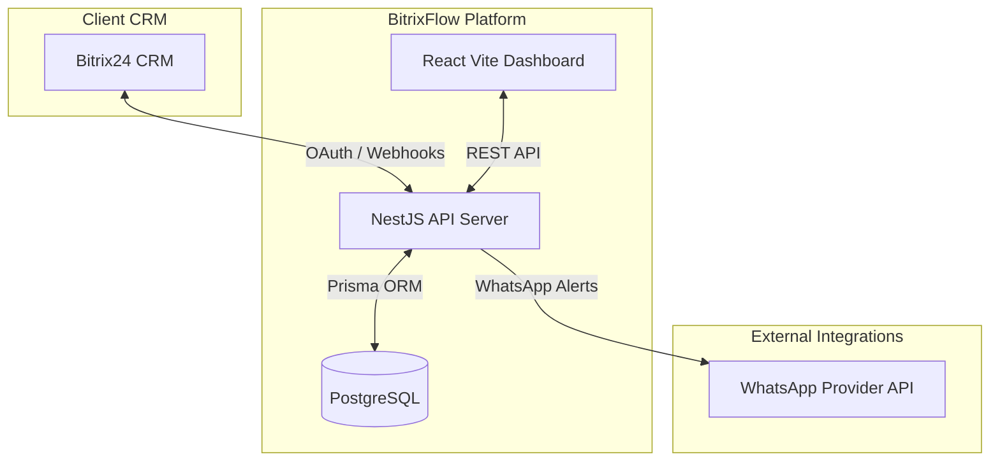
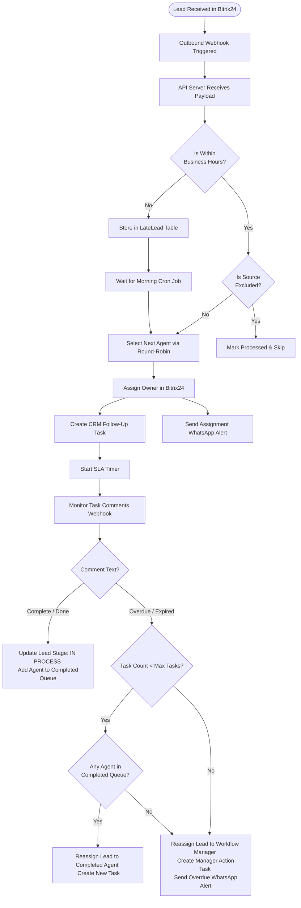

# BitrixFlow - Sales Operations & Lead Distribution Platform

BitrixFlow is a custom, external **Sales Operations & Lead Distribution Platform** designed to integrate with and extend **Bitrix24 CRM**. It is specifically tailored for high-volume sales environments to manage fair lead distribution, follow-up SLA compliance, agent availability, and automated alerts.

---

## 1. System Architecture

## 🏗️ Architecture

The system splits responsibilities between the primary CRM workspace and the workflow automation engine. Bitrix24 remains the system of record, while BitrixFlow executes the rules.



---

## ⚡ Lead Journey & Workflow



---

## 3. Technology Stack

*   **Backend**: NestJS (TypeScript), REST API, `@nestjs/schedule` (Cron Engine)
*   **Frontend**: React, Vite, Tailwind CSS (styled to match the Bitrix24 UI)
*   **Database**: PostgreSQL (Production) / SQLite (Development) via Prisma ORM
*   **WhatsApp API**: Native integration with OnCloud API (`apps.oncloudapi.com`)
*   **Deployment**: Dokploy, Docker

---

## 4. Setup and Local Development

### 1. Configure Environment Variables
Create a `.env` file in `apps/api/.env`:
```env
PORT=3000
DATABASE_URL="file:./dev.db" # SQLite for local development

# Bitrix24 Application Credentials
BITRIX_PORTAL_URL=https://your-crm.bitrix24.com
BITRIX_CLIENT_ID=your_client_id
BITRIX_CLIENT_SECRET=your_client_secret
BITRIX_REDIRECT_URI="http://localhost:3000/api/bitrix/oauth/callback"
BITRIX_WEBHOOK_TOKEN=your_inbound_webhook_url

# Frontend Dashboard URL
FRONTEND_URL="http://localhost:5173"

# OnCloud WhatsApp API
ONCLOUD_API_TOKEN=your_oncloud_token
```

Create a `.env` file in `apps/dashboard/.env`:
```env
VITE_API_URL="http://localhost:3000"
```

### 2. Run Database Migrations
```bash
cd apps/api
npx prisma db push
```

### 3. Install Dependencies and Run
From the root directory:
```bash
# Install root and workspace dependencies
npm install

# Start Backend (NestJS)
cd apps/api
npm run start:dev

# Start Frontend (React)
cd apps/dashboard
npm run dev
```

---

## 5. Dokploy Deployment Guide

### Option 1: Using Docker Compose (Single Service Setup)
1. Go to your **Dokploy Dashboard** -> **Projects**.
2. Click **Create Service** and select **Compose** (not Application).
3. Connect your Git repository: `https://github.com/usmankhan4001/Bitrix-Workflow-Manager.git`.
4. Dokploy will automatically detect the root `docker-compose.yml` and build the API, Dashboard, and Postgres DB.
5. In the Compose environment configuration, paste your production settings.

### Option 2: Deploying as Separate Services (Recommended)
To deploy the backend and frontend as separate Dokploy Application services:

#### A. NestJS API Service
1. Create a new **Application** service in Dokploy.
2. Under **Build Configuration**, set:
   * **Dockerfile Path**: `apps/api/Dockerfile`
   * **Context Path**: `apps/api`
3. Expose port `3000`.

#### B. React Dashboard Service
1. Create a new **Application** service in Dokploy.
2. Under **Build Configuration**, set:
   * **Dockerfile Path**: `apps/dashboard/Dockerfile`
   * **Context Path**: `apps/dashboard`
3. Expose port `80`.

---

## 6. Webhooks Setup in Bitrix24

To connect your Bitrix24 portal with the deployed server, configure the following webhooks under **Developer Resources -> Webhooks -> Outbound Webhooks**:

1.  **Lead Assignment webhook** (`ONCRMLEADADD`):
    *   **Handler URL**: `https://your-domain.com/api/workflow/assign-lead`
2.  **Task Comments Webhook** (`ONTASKCOMMENTADD`):
    *   **Handler URL**: `https://your-domain.com/api/workflow/webhook/task-comment`
3.  **Lead Reassignment Tracking** (`ONCRMLEADUPDATE`):
    *   **Handler URL**: `https://your-domain.com/api/workflow/webhook/lead-change`
