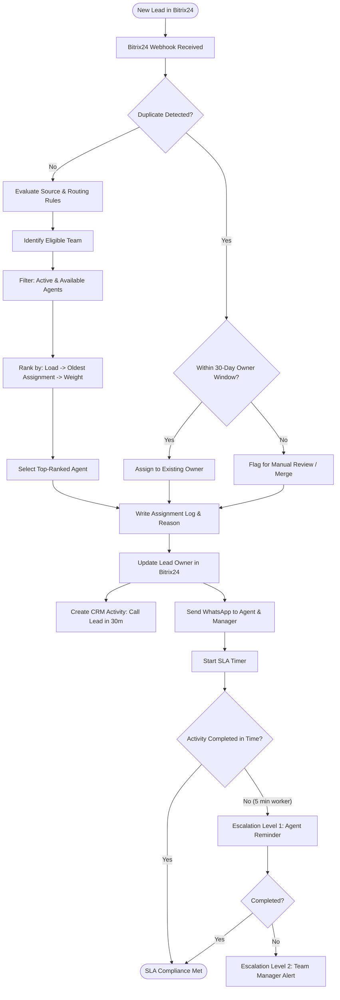

# BitrixFlow - Project Overview & Technical Specification Analysis

BitrixFlow is a custom, external **Sales Operations & Lead Distribution Platform** designed to integrate with and extend **Bitrix24 CRM**. It is specifically tailored for **Premier Choice International (PCI)**, a major real estate company, to solve typical operational challenges in high-volume sales environments (e.g., unfair lead distribution, slow follow-ups, agent inactivity, lead theft, and poor manager visibility).

---

## 1. System Philosophy & Architecture

The system splits responsibilities clearly between the primary CRM workspace and the workflow automation engine:

*   **CRM Data Lives in Bitrix24:** Bitrix24 remains the system of record for leads, deals, contacts, activities, and agent workspaces.
*   **Business Logic Lives in BitrixFlow:** BitrixFlow controls the logic for assignments, SLAs, escalations, source routing, notifications, and compliance.
*   **Everything is Configurable:** There is zero hardcoded logic (such as hardcoded User IDs, team names, or pipeline stages) in the code. All mappings and rules are stored in the database and manageable via a no-code Rule Builder interface.

### System Architecture Diagram
```mermaid
graph TD
    subgraph Client CRM
        B24[Bitrix24 CRM]
    end
    
    subgraph BitrixFlow Platform
        UI[React Vite Dashboard]
        API[NestJS API Server]
        Redis[(Redis Queues)]
        DB[(PostgreSQL 16 + Prisma)]
    end
    
    subgraph External Integrations
        WA[WhatsApp Providers <br/> Meta, WAHA, Twilio, etc.]
        Mail[Email / SMTP]
    end

    B24 <-->|OAuth, Webhooks, Sync Engine| API
    UI <-->|REST API + JWT| API
    API <-->|Prisma ORM| DB
    API <-->|Job Queueing| Redis
    API -->|sendMessage() / sendTemplate()| WA
    API -->|Notifications| Mail
```

---

## 2. Core Modules (20 Total)

The platform is designed around 20 modules to handle all operations:

| # | Module | Core Responsibility |
|---|---|---|
| **1** | **Bitrix24 Integration Core** | Two-way syncing of leads, users, stages, pipelines, custom fields, and activities via webhooks & REST API. |
| **2** | **Lead Distribution Engine** | Handles routing using algorithms: Round Robin, Active Round Robin, Load-Balanced (least leads assigned today), Weighted (e.g., senior vs. junior), and Hybrid (priority-based). |
| **3** | **Agent Management Engine** | Tracks agent statuses (Available, Busy, Break, Leave, Offline) and handles capacity/priority. Only "Available" agents receive leads. |
| **4** | **Team Management Engine** | Groups agents into units (e.g., Telesales, Sales Executives) with designated managers, fallbacks, and SLA profiles. |
| **5** | **Workflow Manager Engine** | Routes fallbacks, approval flows, and unassigned/escalated leads to the Workflow Manager. |
| **6** | **Follow-up SLA Engine** | Measures and enforces response deadlines based on lead source (e.g., Meta Ads: 15 mins, Referral: 2 hours). |
| **7** | **Activity Engine** | Automatically creates CRM tasks/activities in Bitrix24 (e.g., "Call Lead" with a 30-min deadline upon assignment) and monitors completion. |
| **8** | **Duplicate Detection Engine** | Scans CNIC, phone, and email to merge, link, or flag duplicate leads for review. |
| **9** | **Lead Ownership Engine** | Locks lead ownership to an agent for a configurable window (default: 30 days) to prevent "lead theft" between agents. |
| **10**| **WhatsApp Notification Engine** | Direct integration with Meta Cloud, Twilio, WAHA, etc. to notify agents of new assignments and escalate delayed responses. |
| **11**| **Audit Log Engine** | Logs all administrative changes (e.g., status changes, routing rules, manual overrides). |
| **12**| **Assignment Logs Engine** | Logs details on every assignment choice so managers can answer "Why did this lead go to this agent?" in a single click. |
| **13**| **Marketing Attribution Engine** | Parses and stores UTM parameters (campaign, adset, ad) to trace deals back to specific ad spend. |
| **14**| **Reporting Engine** | Generates analytics on agent performance, team load, lead source volumes, and SLA compliance. |
| **15**| **Dashboard Engine** | Provides managers real-time KPIs, active SLA breaches, and live queues. |
| **16**| **Rule Builder Engine** | No-code interface (`IF [Source] = Meta AND [Project] = Box Park THEN Assign Team [Telesales]`). |
| **17**| **Bitrix Metadata Sync Engine** | Runs scheduled cron jobs (every 15 minutes) to synchronize users, pipelines, pipelines stages, and sources. |
| **18**| **System Settings Engine** | Configures working hours, days, fallback rules, and global parameters. |
| **19**| **Security Engine** | Manages JWT, refresh tokens, and Role-Based Access Control (RBAC). |
| **20**| **AI Intelligence Layer** | *Future Module* (Lead scoring, recommender systems, conversion predictions). |

---

## 3. Detailed Lead Journey Flow
This flowchart visualizes the lifecycle of a new lead from entry to assignment and SLA tracking:



---

## 4. Technical Stack & Deployment Blueprint

### Technologies
*   **Database:** PostgreSQL 16+
*   **ORM:** Prisma ORM (using `snake_case` naming conventions and `UUID` primary keys).
*   **Backend:** NestJS (monorepo/modular architecture: `src/auth`, `src/bitrix`, `src/assignments`, etc.).
*   **Frontend:** React, Vite, Tailwind CSS.
*   **Queues / Background Processing:** Redis.
*   **Deployment:** Hetzner, Dokploy, Docker containers (`api`, `dashboard`, `postgres`, `redis`, `backup-service`). Cloudflare handles security, DNS, and SSL.

### Core Database Entities
*   `organizations` (Multi-tenant support)
*   `users` (RBAC roles: `Super Admin`, `Sales Director`, `Workflow Manager`, `Team Manager`, `Viewer`)
*   `teams` (Managed by user, supports assignment method config)
*   `agents` (Tied to Bitrix User ID; holds status, capacity, priority, weight)
*   `source_routes` & `assignment_rules` (Rule engine config)
*   `assignments` & `assignment_events` (Tracking and timeline events)
*   `workflow_activities` (Bitrix activity tracking)
*   `escalation_logs` (Tracks SLA violation state and alerts)
*   `campaign_attribution` (UTM mapping)
*   `audit_logs` (Actor-action trace table)

---

## 5. UI/UX & Main Screens

The UI/UX is built specifically for **operational speed**, utilizing sleek dark mode, clear gradients, micro-animations, and minimal navigation (tasks completed in 1-3 clicks).

### Primary UI Screens
1.  **Dashboard Home (`/dashboard`):** KPI cards (Leads Today, Assigned, Pending, Escalated, SLA Compliance %, Active Agents) and a Live Operations Panel displaying unassigned leads and active SLA breaches.
2.  **Live Queue (`/operations/live-queue`):** Real-time monitoring of all incoming leads with quick actions (View, Open Bitrix, Manual Assign, Escalate).
3.  **Assignments & Detail Drawer (`/operations/assignments`):** Full chronological log. Selecting an assignment opens a drawer revealing a **decision tree** explaining *exactly* why that agent was selected.
4.  **Escalations Screen (`/operations/escalations`):** Color-coded log (Green = L0, Yellow = L1, Orange = L2, Red = L3+). Allows transfer or manager override.
5.  **Agent & Team Management (`/management/agents`, `/management/teams`):** Detailed dashboards to toggle availability, reassign teams, and review performance/audit history for individual agents.
6.  **Source Routing & Rule Builder (`/management/source-routing`, `/management/rules`):** Visual mapping interfaces for routing leads by source, campaign, or project with high/low priority.
7.  **Bitrix Sync Screen (`/admin/bitrix-sync`):** Interface to monitor, trigger, and view logs of periodic users, stages, and sources sync events.
8.  **WhatsApp Templates (`/admin/notifications`):** Variables editor (e.g., `{{lead_name}}`, `{{agent_name}}`) to structure message templates for notifications.

---

## 6. Go-Live & Verification Plan

The technical blueprint structures deployment into 6 phases:
1.  **Infrastructure:** Set up Hetzner server, Dokploy, SSL, PostgreSQL, Redis, and Domain mappings.
2.  **Bitrix:** Configure OAuth flow, setup webhook listeners, and run initial metadata sync (Users, Stages, Sources).
3.  **Assignment Logic:** Configure teams, agents, routing tables, and default settings.
4.  **Notifications:** Hook up WhatsApp API provider accounts and set up escalation profiles.
5.  **Testing:** Simulate lead imports, check duplicate merging, trigger SLA timer alerts, and run fallback routes.
6.  **Production:** Point production webhooks to BitrixFlow and monitor logs.
